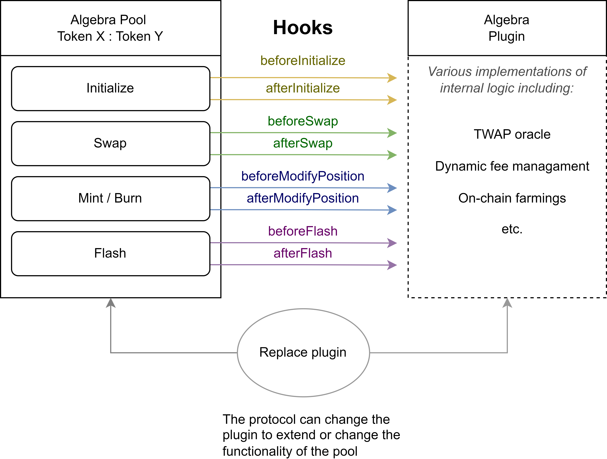

# Plugins

The functionality of the Algebra Integral protocol can be extended and supplemented by using customizable plugins.

**A plugin** is a smart contract that is attached to a pool contract and extends its functionality. Only one plugin can be attached to each pool at any given time.

A plugin can be detached or replaced by another plugin.

More information about plugins, existing implementations and development of new plugins can be found in [the plugins section](broken-reference).

### Hooks

Interaction of plugins with Algebra Integral pools is based on the use of hooks - special calls that the pool can make before and after the main user actions.

If a plugin is attached to the pool and a setting corresponding to a given hook is activated, the liquidity pool will call a function defined in the Algebra plugin interface from the plugin. Within this function, arbitrary logic can be implemented in the plugin, including including interaction with the same liquidity pool.

The pool provides the following hooks:

* `beforeInitialize` - called at the beginning of pool initialization..&#x20;
* `afterInitialize` - called after the initialization of the pool.
* `beforeModifyPosition` - called before a change in any liquidity position. The call can occur before a liquidity mint or burn.
* `afterModifyPosition` - called after a change in any liquidity position. The call can occur before a liquidity mint or burn.
* `beforeSwap` -  called before the swap
* `afterSwap` - called after the swap
* `beforeFlash` - called before the flashloan
* `afterFlash` - called after the flashloan

This way, the plugin can perform any actions before and after key events in the pool.

<figure><figcaption></figcaption></figure>

### Fee management

Algebra Integral pools can have dynamic fee mode enabled. In this case, the attached plugin will be able to change the current value of the fee in the pool at any time. Including during the call of hooks, which allows, for example, to change the fee before swap, taking into account certain factors on the market.

After the dynamic fee mode is enabled, the plugin (and only the plugin) can change the fee using the `setFee` method of the liquidity pool. If dynamic fee mode is turned off, the plugin cannot change the pool's fee (the fee can only be changed by the owner of the corresponding rights in AlgebraFactory).

### Plugins settings

Pool parameters associated with a plugin are stored tightly packed in a bitmap. The following flags (bitmasks) correspond to the settings:

* `BEFORE_SWAP_FLAG = 1` - whether to use the `beforeSwap` hook
* `AFTER_SWAP_FLAG = 1 << 1` - whether to use `afterSwap` hook
* `BEFORE_POSITION_MODIFY_FLAG = 1 << 2` - whether to use the hook `beforeModifyPosition`
* `AFTER_POSITION_MODIFY_FLAG = 1 << 3` - whether to use the `afterModifyPosition` hook.
* `BEFORE_FLASH_FLAG = 1 << 4` - whether to use the hook `beforeFlash`
* `AFTER_FLASH_FLAG = 1 << 5` - whether to use the `afterFlash` hook
* `AFTER_INIT_FLAG = 1 << 6` - whether to use the `afterInitialize` hook
* `DYNAMIC_FEE = 1 << 7` - whether dynamic commission mode is enabled

**It is important to note** that there is no setting for the `beforeInitialize` hook - this hook is called unconditionally if the plugin is attached before pool initialization. For this reason, the plugin must necessarily implement the corresponding method correctly if it will be attached before pool initialization.

### Plugin replacement

In each pool, a plugin can be replaced at any time by an address with the appropriate rights (owner AlgebraFactory, or owner of the `POOLS_ADMINISTRATOR` role). The plugin is replaced using the `setPlugin` method in the liquidity pool itself.

**It is important to note** that access to the ability to replace plugins should be controlled with maximum security, as this action allows changing the logic of the liquidity pool. Malicious plugin replacement can lead to negative consequences for users. It is strongly recommended to take additional protection measures, including the use of multi-sig accounts and the implementation of more granular access rights.
